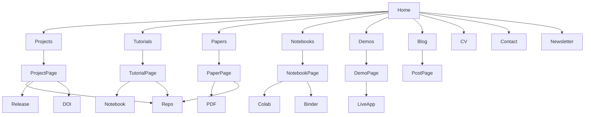
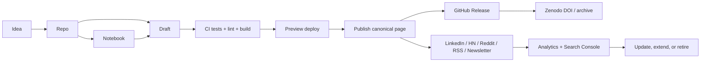

# Designing brandon-behring.dev as a research publication system

> **⚠ Original brainstorm (2026-05-26) — superseded; kept for provenance.** This is the raw
> pre-redesign braindump. The decisions it explores are now settled in
> [`docs/website-decision-map.md`](docs/website-decision-map.md) (strategy) +
> [`docs/roadmap.md`](docs/roadmap.md) (forward plan); live state →
> [`CURRENT_WORK.md`](CURRENT_WORK.md). Not live guidance. (Its "Home, Work, About, Contact"
> nav snapshot is long obsolete — the live nav is 8 items; `src/components/Header.astro` is the SSOT.)

## Executive summary

The public version of **brandon-behring.dev** already communicates strong thematic pillars—applied causal methods, AI evaluation, and course-derived study notes—but its visible top-level navigation is still portfolio-like rather than artifact-like, exposing only **Home, Work, About, and Contact**. Your public GitHub profile already contains a stronger artifact inventory than the site does, with pinned repositories such as **research-kb**, **prompt-injection-detection-prototype**, **eval-toolkit**, **research_toolkit**, **runpod-deploy**, and **temporalcv**. The core opportunity is therefore not “add more content,” but **re-frame the site as the canonical home for research artifacts, tutorials, notebooks, and releases** so that each repository and manuscript becomes easier to discover, evaluate, cite, and share. citeturn18view0turn21view0

The best design direction is to treat the site as a **research publishing system** rather than a personal homepage. That means organizing navigation around artifact classes, using stable canonicals and sitemaps, emitting structured metadata, attaching citation files and DOI-ready releases to repositories, and building a consistent per-artifact template that includes abstract, TL;DR, reproducibility notes, code/data links, and licensing. Google explicitly recommends people-first content, canonical URL signaling, sitemaps, and structured data for article pages; GitHub and Zenodo support machine-readable citation metadata and DOI issuance; and Quarto, Astro, Next.js, Jupyter Book, and related tooling all support the technical pieces needed to assemble this into a coherent system. citeturn35search0turn36view3turn37view4turn37view5turn36view4turn36view5turn36view0turn36view2

My strongest recommendation is a **hybrid default stack**: keep the main site content-driven and fast with **Astro + MDX/content collections**, use **Quarto** for notebook-heavy and citation-heavy artifacts, run **GitHub Actions** for build/test/deploy, publish the canonical site on **Netlify** for deploy previews and forms, and keep **GitHub Releases + Zenodo** as the archival and citation backbone for code and datasets. If you want the simplest possible path, a Quarto-first site is also strong; if you want the richest bespoke UI and route-specific social cards, Astro is the better primary shell. citeturn31search3turn36view2turn36view0turn36view1turn36view6turn4search0turn4search2turn36view5

The distribution model should be **domain first, platform second**. Publish the canonical artifact on your domain, attach a versioned release on GitHub, archive important releases in Zenodo, then distribute a tailored summary on LinkedIn, selective Hacker News/Reddit submissions, and email/RSS. This protects long-term discoverability while using external platforms for reach. LinkedIn newsletters and post analytics are useful for professional reach; Hacker News and Reddit can work for technically interesting demos and writeups when you follow each community’s anti-promotion norms; and RSS-to-email bridges your site to a newsletter without surrendering canonicals. citeturn38view0turn38view1turn39view0turn39view1turn39view2turn39view3turn29search0turn29search2

## Site goals and target audiences

Your site should serve **three jobs at once**. First, it should let technically sophisticated readers evaluate whether your work is rigorous and reproducible. Second, it should let busy hiring managers, founders, or collaborators understand your range in minutes. Third, it should let advanced practitioners and learners reuse your code, notes, and benchmarks without having to reverse-engineer intent from repositories alone. Those jobs are already implicit in your public homepage language around causal inference, AI evaluation, and study notes, and in the public GitHub portfolio that foregrounds reusable tooling and references. citeturn18view0turn21view0

That implies five primary audience segments: **peer researchers**, **research engineers / ML practitioners**, **technical decision-makers and hiring managers**, **advanced learners**, and **potential collaborators**. The same artifact can serve multiple audiences, but each audience lands with a different question. Researchers ask “Is this sound?” Practitioners ask “Can I run this?” Hiring managers ask “What have you shipped?” Learners ask “Can I understand this without reading five papers first?” Collaborators ask “Is there a concrete opening to work together?” A good site architecture should map these questions directly to landing pages and CTAs rather than hoping visitors infer them from a generic “Work” page. This is also aligned with Google’s guidance to create helpful, reliable, people-first content and to use words people would actually search for in prominent locations such as titles and headings. citeturn35search0turn35search1

The positioning should therefore be explicit: **“AI/ML research engineering, with a focus on causal inference, pricing/decision systems, JAX/SSMs, context engineering, and evaluation.”** The homepage should not try to summarize everything equally. Instead, it should act as a routing layer into a few durable program areas—likely **Causal Methods**, **Evaluation & Safety**, **Sequence Models & Dynamics**, and **Research Engineering / Tooling**—and then show the latest papers, tutorials, notebooks, and demos underneath each. That structure matches both your current homepage themes and the artifact-first expectations of technical readers. citeturn18view0turn21view0

A useful rule is: **every top-level page should answer one high-stakes question quickly**.  
Home: “What kind of work does Brandon do, and what is new?”  
Projects: “What substantive things exist?”  
Tutorials: “What can I learn here?”  
Papers: “What is citable or manuscript-grade?”  
Notebooks: “What can I run interactively?”  
Demos: “What can I play with?”  
CV/About: “What is the background and track record?”  
Contact/Newsletter: “How do I stay in touch?”  
Quarto websites explicitly support shared site navigation, search, and listings for groups of documents, which makes this artifact-first organization natural rather than forced. citeturn36view0turn1search4

## Content system and artifact templates

The site should support six core artifact families: **papers/manuscripts**, **reproducible repositories**, **tutorials**, **experiment logs**, **teardown posts**, and **short updates**. Across all six, the invariant is that technical readers should always find: a stable title and permalink, author/date/version metadata, a one-paragraph abstract, a shorter TL;DR, links to code/data/notebooks, explicit license information, and machine-readable citation metadata where appropriate. GitHub recommends README files so readers understand usefulness and usage; GitHub also supports `CITATION.cff` files natively; Zenodo can archive public repositories and issue a DOI on each GitHub release; and Quarto/Jupyter tooling supports executable, citation-rich documents. citeturn22search0turn22search12turn36view4turn36view5turn36view1turn17search0turn17search10

The table below summarizes a practical template system for your content. The template design is grounded in official documentation for executable publishing, citation metadata, licensing, and repository documentation, but the exact field set is my recommendation for your use case. citeturn36view1turn36view4turn36view5turn22search0turn28search5turn33search0

| Artifact type | Primary job | Required elements | High-value optional elements | Best CTA |
|---|---|---|---|---|
| Research paper / manuscript | Establish novelty, rigor, and citation-worthiness | Title, abstract, TL;DR, date/version, contribution bullets, PDF/HTML, repo link, data link, bibliography/citation metadata, license, DOI or “forthcoming DOI” | Appendix, benchmark table, threat model / limitations, reproducibility checklist, changelog | Cite / read / open repo |
| Reproducible repo | Enable direct reuse | One-sentence summary, why it matters, quickstart, install instructions, example command, environment spec, tests badge, license, `CITATION.cff`, release link | Demo GIF/video, benchmark summary, Colab badge, Docker image, Zenodo DOI | Star / install / reproduce |
| Tutorial | Teach method or workflow | Learning objective, prerequisites, TL;DR, why/when/when-not, runnable code snippet, notebook, expected output, pitfalls | Diagram, benchmark, interactive widget, references, downloadable notebook | Run notebook / try code |
| Experiment log | Show research process and decision quality | Context, hypothesis, setup, metrics, result, failure analysis, next step, date, commit/release reference | Artifact bundle, plots, ablation table, issue tracker link | Follow progress / open issue |
| Teardown / analysis post | Demonstrate judgment and synthesis | Object of analysis, framing question, architecture or concept diagram, strengths, limits, references, caveats | Comparative matrix, code snippets, reproduction notes | Read related project / contact |
| Short update | Keep activity visible with low overhead | 100–300 word summary, one image or figure, one link, one next step, date | Embedded chart, quick metric, newsletter blurb | Subscribe / click through |

For your domain specifically, I would enforce a **common article skeleton** for nearly all long-form pages:

1. **Title**  
2. **Abstract**  
3. **TL;DR**  
4. **Why this matters**  
5. **Artifact links**: repo, notebook, release, DOI, dataset  
6. **Main body**  
7. **Benchmarks / evidence**  
8. **Reproducibility checklist**  
9. **Limitations / failure modes**  
10. **How to cite / license**  
11. **Related artifacts**

That skeleton follows the spirit of Google’s people-first content guidance, GitHub’s emphasis on explaining usefulness and usage, and the executable-publication approach of Quarto and Jupyter Book. citeturn35search0turn22search0turn17search0turn36view1

For **reproducibility**, I recommend a visible checklist on every substantive project page. It should include environment pinning (`pyproject.toml` or equivalent), exact install commands, hardware assumptions where relevant, data provenance and licensing, random seeds if stochasticity matters, expected runtime, expected output artifact names, and CI status. Packaging guidance from Python packaging, Docker, JAX installation, and The Turing Way all point in the same direction: make dependencies explicit, make environments portable, and make legal reuse conditions visible. citeturn6search2turn6search21turn5search10turn5search3turn28search2turn28search10

For **citation metadata**, use both **page-level** and **repository-level** metadata. On the repository side, add `CITATION.cff` so GitHub shows a “Cite this repository” prompt, and connect the repository to Zenodo so tagged releases get DOIs. On the page side, include a formatted citation block plus BibTeX/APA copy buttons where the artifact merits it. If you later want deeper software metadata interoperability, CodeMeta is a reasonable extension, but `CITATION.cff` + DOI + consistent landing pages is the high-value baseline. citeturn36view4turn36view5turn33search0turn33search1

For **licensing**, distinguish between code, data, and prose. GitHub notes that a public repo without a license is not truly open source; Creative Commons explicitly recommends their licenses for copyrightable works other than software; and The Turing Way recommends making licenses clearly visible on the artifacts they govern. In practice: use an OSI license for code, a data-specific or CC-style license for datasets when appropriate, and a clear prose/documentation license for notes or tutorial text if you want permissive reuse. citeturn28search5turn28search0turn28search2turn28search10

## Site architecture, metadata, and discoverability

The top-level navigation should change from a résumé-style shell to a **publishing graph**:

**Home · Projects · Tutorials · Papers · Notebooks · Demos · Blog · CV · Contact · Newsletter**

This is not just a cosmetic change. Quarto websites explicitly support navbars, sidebars, listings, and site search; Astro content collections are designed to model groups of related structured content; and Google’s sitemap guidance emphasizes that important pages should be reachable through site navigation even when a sitemap is present. In other words, clean taxonomy and crawlable navigation are load-bearing for both humans and search. citeturn36view0turn36view2turn37view4



On the homepage, keep the hero short and specific. Replace generic self-description with: **one-sentence positioning**, **three program-area cards**, **latest artifacts**, and **one call to action for subscription / contact**. The current homepage already has the raw content for the program-area cards; the redesign is mainly about exposing them as durable, browsable hubs instead of buried “More” links. citeturn18view0

For **URLs and canonicals**, prefer a flat-but-semantic structure such as `/tutorials/<slug>/`, `/papers/<slug>/`, `/projects/<slug>/`, and `/notes/<slug>/`. Google says redirects and `rel="canonical"` are strong canonicalization signals, while sitemap inclusion is weaker, and that consistent internal linking to the canonical URL helps Google understand your preference. Astro also requires a correctly configured `site` option to generate canonicals and sitemaps cleanly. citeturn36view3turn37view2

For **structured metadata**, I would implement at least the following JSON-LD patterns:

- **Home / About / CV**: `ProfilePage` with `Person` properties and stable identity links. Google’s profile-page documentation explicitly recommends `Person` or `Organization` properties here. citeturn16search17turn16search3
- **Blog / tutorials / teardown posts**: `Article` or `BlogPosting`, with author, headline, dates, and image. Google’s Article guidance says article structured data can help Google understand pages and show better title, image, and date information. citeturn37view5turn16search2turn16search16
- **Software and data pages**: even if you do not fully model them with page-level schema on day one, ensure the linked repo/release/archive already exposes machine-readable metadata via `CITATION.cff`, DOI metadata, and visible licensing. citeturn36view4turn36view5turn28search3

For **social metadata**, implement Open Graph on every page and generate route-specific share images for every major artifact. The Open Graph protocol exists specifically so pages can become rich objects in social graphs, and Next.js’s metadata system shows the modern pattern clearly: route-specific `opengraph-image` and `twitter-image` files or code-generated images. LinkedIn’s sharing guidance also documents a preview image ratio of roughly **1.91:1** and calls out **1200 × 627 px** as the preview size. citeturn9search0turn37view0turn37view1turn38view3

For **feeds and syndication**, expose both **RSS** and, if you want standards completeness, **Atom**. Astro and Quarto both support RSS generation; RSS remains the practical compatibility choice for many readers and automations, while Atom is an IETF standard feed format. Buttondown can also turn an RSS feed into email delivery, which is a clean way to make the site the origin and the newsletter the distribution layer. citeturn37view3turn15search3turn15search1turn34search0turn29search0

## Technical stack and publishing infrastructure

The technical decision is best made by asking a simple question: **which constraint is more important—scientific-document ergonomics or bespoke interaction/design ergonomics?** Quarto is strongest when the answer is “scientific-document ergonomics.” Astro is strongest when the answer is “custom site shell with light interactivity and excellent performance.” Next.js is strongest when the answer is “web app plus content site.” Hugo remains attractive when the answer is “simple, static, very fast, low Ruby/JS complexity.” Jupyter Book is strongest for notebook-native and textbook-like publishing. citeturn36view0turn36view1turn31search3turn31search1turn32search0turn32search2turn24search1turn17search0

The comparison below is a synthesis of official framework and hosting documentation plus the needs implied by your current public work. citeturn31search3turn36view2turn36view0turn32search0turn24search1turn17search0turn3search21turn4search0turn4search5

| Stack | Strengths | Weaknesses | Best use here | Verdict |
|---|---|---|---|---|
| **Astro + MDX + content collections** | Excellent for content-driven sites, selective interactivity via islands, typed collections, easy static deployment, strong SEO ergonomics | Notebook/citation workflows are not as native as Quarto | Canonical main site, tutorials, project pages, demos with light interactivity | **Best primary shell** |
| **Quarto website/blog** | Native citations/bibliography, executable notebooks, scientific publishing, multiple output formats, listings/search | Harder to make highly bespoke UI system; interactive React-heavy demos less natural | Papers, notebook-heavy tutorials, long technical essays | **Best research-document layer** |
| **Next.js + MDX** | Richest app capabilities, dynamic OG images, MDX with React, strong Vercel integration | Heavier than necessary for mostly-static publishing, more operational complexity | If you expect authenticated tools or richer apps under the same domain | Strong, but overkill unless app needs dominate |
| **Hugo** | Very fast, mature static publishing, clean URL/front matter tooling, diagram support | Less natural for executable notebooks and research-citation workflows | Simple long-form writing site with minimal runtime complexity | Good static fallback |
| **Jupyter Book / MyST** | Excellent for notebook-native computational narratives, executable content, reusable/reproducible narratives | Feels more “book/docs” than “personal research publication site” | Deep note sets, course notes, textbook-like series | Best for a subsite, not the whole brand site |

My recommendation is a **hybrid monorepo**:

- **Astro** for `brandon-behring.dev`
- **Quarto** for papers/notebooks/tutorial artifacts that benefit from executable publishing and bibliography management
- **GitHub Actions** for CI/CD
- **Netlify** for the primary deployment
- **GitHub Releases + Zenodo** for archival/distribution/citation
- **Plausible + Search Console** for measurement

This gives you an artifact-rich research site without forcing every page into a notebook-first workflow. GitHub Actions can build/test/deploy on pull requests and merges; Netlify gives you Deploy Previews and built-in forms; GitHub Releases package versioned artifacts; Zenodo mints DOIs from releases. citeturn36view6turn4search0turn4search2turn14search1turn14search0turn36view5

If you prefer to keep everything under GitHub-native infrastructure, **GitHub Pages is completely viable for a static site**, including custom domains, HTTPS, and deployment from custom workflows. The trade-off is operational ergonomics: Pages is excellent for low-friction static hosting, but Netlify and Vercel are better for preview workflows and ancillary features. citeturn3search21turn3search1turn3search7turn36view7

For **CMS choices**, I would default to **Git as the CMS** because your content is technical, versioned, and code-adjacent. If you want a friendlier editor UI later, **Decap CMS** is the most natural low-friction overlay for a static-site workflow because it stores content in Git and supports editorial workflows via pull requests. If you eventually grow into a multi-editor structured publishing operation, **Sanity** becomes more compelling. citeturn25search4turn25search0turn25search1turn25search21

A practical starter configuration would look like this:

- `content/projects/`
- `content/tutorials/`
- `content/papers/`
- `content/notes/`
- `content/updates/`
- `notebooks/` for Quarto or MyST sources
- `components/` for shared cards, benchmark tables, citation boxes, notebook embeds
- `public/og/` or generated route-based OG image pipeline
- `.github/workflows/` for lint, tests, build, deploy, release, DOI automation

Keep **all assets in one monorepo** unless a project truly needs its own deployment cadence. Technical readers reward coherence more than organizational purity.

## UX, reproducibility, and packaging

The UX goal is not “beautiful minimalism.” It is **high-trust readability**. For your audience, that means legible typography, obvious hierarchy, code blocks that are easy to copy, diagrams placed next to the paragraphs they explain, benchmarks presented before conclusions harden into claims, and interactive elements used when they improve understanding rather than as decoration. Distill’s synthesis of interactive articles is especially relevant here: interactive articles can improve engagement and learning when they use the web’s dynamic affordances well, but authors must still control complexity, performance, and mobile readability. Google’s Core Web Vitals guidance reinforces the performance side of that equation. citeturn30view0turn8search3turn8search7

Practically, I would adopt these UX rules:

- Keep prose widths moderate and increase line spacing slightly above default.
- Put the **TL;DR** before the fold on every long page.
- Use **callout blocks** for assumptions, caveats, and failure modes.
- Show **copy buttons** and filenames on code blocks.
- Give every figure an informative caption, not just a label.
- Never let a tutorial page end without a runnable next step.
- Reserve interactive widgets for model intuition, hyperparameter sweeps, ablations, or architecture exploration—where interaction genuinely teaches.

Those are design recommendations, but they are supported by the broader interaction evidence summarized by Distill and by the performance/discoverability constraints documented by Google and Astro. citeturn30view0turn31search1turn8search3

For **notebooks and runnable artifacts**, use a layered strategy rather than one tool for everything. **Colab** is excellent for quick reader activation because notebooks combine code and rich text in one document and are easy to open from GitHub. **Binder** is helpful for lightweight CPU demos, but its own docs emphasize that sessions are ephemeral and shut down after inactivity, so it should not be your only reproducibility path. For serious reproducibility, provide **Docker** images and pinned environments; for JAX projects specifically, state the target accelerator path clearly because installation differs across CPU and GPU variants. citeturn5search21turn5search24turn5search12turn5search10turn5search3

For **downloadable artifacts**, use GitHub Releases aggressively. GitHub’s release system exists to package software with release notes and binary files, and GitHub also supports stable `releases/latest` linking for the newest release. In practice, each meaningful project should ship a release bundle containing one or more of: source snapshot, notebook bundle, PDF/manuscript, benchmark artifacts, Docker reference, and changelog. That gives your site stable “Download the artifact bundle” buttons that do not depend on the repo’s current branch state. citeturn14search1turn14search0turn14search14

A publication workflow that matches your goals is:



This workflow matters because it aligns page publication, repository versioning, citation, and distribution into one cycle instead of treating them as separate chores. GitHub Actions is explicitly built for automating build/test/deploy pipelines, and both Netlify and Vercel support preview environments for live review before production. citeturn36view6turn4search0turn4search5

## Distribution, measurement, cadence, and launch playbook

The core rule for sharing is: **publish canonical first, then adapt the wrapper per channel**. Your own domain should always hold the full artifact, because that is where you control canonical URLs, structured data, archives, and long-term navigation. Then distribute **summaries**, not mirrors, except when you deliberately syndicate through RSS/email. This respects Google’s canonicalization model and avoids turning your site into a shadow of platform-native posts. citeturn36view3turn29search0turn37view3

The channel strategy below is the most efficient version of “effective sharing” for a researcher-engineer profile. The behavior recommendations are synthesized from official platform guidance and the mechanics each platform exposes. citeturn38view0turn38view1turn38view2turn38view3turn39view0turn39view1turn39view2turn39view3turn14search1

| Channel | Best artifact types | Post format that fits | Primary CTA | Main caution |
|---|---|---|---|---|
| **LinkedIn post** | Tutorials, teardowns, project launches, benchmark posts | 1 strong insight, 2–4 supporting bullets, one canonical link, one image | Read tutorial / view project | Optimize preview image and validate with Post Inspector |
| **LinkedIn newsletter** | Ongoing series on causal methods, JAX/SSMs, eval methodology | Recurring essay series with summary + canonical link back to domain | Subscribe | Use it as a reach layer, not the sole archive |
| **GitHub release** | Code, datasets, notebooks, reproducibility bundles | Release notes + attached assets + DOI link | Try or cite | Don’t leave important artifacts only on a moving default branch |
| **Hacker News** | Live demos, serious tools, substantive technical essays | Show HN for something usable; regular submission for essays | Try demo / discuss | HN explicitly discourages using the site mainly for promotion |
| **Reddit** | Deep-dive explanations or tools matched to specific subreddits | Community-native framing, answer-first commentary, then link | Discuss / get feedback | Follow subreddit rules; avoid self-promo-heavy posting history |
| **X / short-form posts** | Quick research updates, charts, launch threads | Insight thread with clear canonical link and card image | Click through | Keep it supplementary unless it is already a strong channel for you |
| **Email / RSS** | Every artifact family | Automatic RSS-to-email or curated digest | Subscribe | Make the site the source, email the transport |

**LinkedIn** deserves special emphasis for your profile. Official help pages confirm that all members can create newsletters, that subscribers receive notifications on each newsletter issue, and that you can view post analytics including discovery, social engagement, link engagement, demographics, and article/newsletter performance. LinkedIn also provides a Post Inspector to refresh cached previews, and its link-sharing docs specify preview image expectations. For a technical professional audience, this makes LinkedIn your best “default external channel” for serious long-form work. citeturn38view0turn38view1turn38view2turn38view3

**Hacker News** and **Reddit** are valuable, but only when the artifact fits. Show HN is explicitly for something people can try, not for generic blog posts or read-only newsletters; HN’s broader guidelines also say not to use the site primarily for promotion. Reddit’s help documentation similarly emphasizes community rules and notes that some communities apply a 10% self-promotion norm. The implication is straightforward: use HN for demos/tools and Reddit only where you are already participating and the post is genuinely helpful to that community. citeturn39view0turn39view1turn39view2turn39view3

**Newsletter distribution** should be simple and site-led. Buttondown’s documentation is attractive here because it supports RSS-to-email automation and embeddable subscriber forms, letting your website remain the publishing origin while email becomes a subscriber delivery layer. That pattern is especially appropriate for research/tutorial publishing, because it avoids duplicating writing effort and keeps archive authority on your domain. citeturn29search0turn29search2turn29search17

Here is a practical **LinkedIn post template** for a new tutorial or project launch:

```text
I published a new write-up on [topic].

The core claim:
[one sentence that makes a technical promise]

What’s inside:
• [insight or finding]
• [what readers can run or reproduce]
• [where it differs from the usual explanation]

I also included:
• code: [repo name]
• notebook/demo: [artifact]
• benchmarks / caveats: [short phrase]

If you work on [relevant field], I’d especially value feedback on:
[precise question]

[canonical link]
```

And here is a **GitHub README template** tuned for research software and reproducible repos, aligned with GitHub’s documentation on READMEs, licenses, citation files, and social previews:

```markdown
# Project title

One-sentence description of what the project does and why it matters.

## Why this exists
- Problem:
- Intended users:
- Main contribution:

## Quickstart
```bash
# install
# run
```

## What you can reproduce
- [ ] Main result
- [ ] Example notebook
- [ ] Benchmark table
- [ ] Figure generation

## Repository structure
- `src/`
- `notebooks/`
- `configs/`
- `data/` or `data_access/`
- `tests/`

## Installation
- Python version:
- Environment manager:
- CPU / GPU notes:
- JAX notes if relevant:

## Minimal example
```python
# tiny runnable example
```

## Results
- Expected output:
- Benchmark summary:
- Known limitations:

## Reproducibility
- Dependency lockfile / `pyproject.toml`
- Random seed policy
- Hardware assumptions
- Test command
- CI status

## Artifacts
- Paper / write-up:
- Release bundle:
- Demo / notebook:
- DOI:

## Citation
See `CITATION.cff`.

## License
- Code:
- Data:
- Documentation:

## Related work
- Project page:
- Related tutorial:
- Open questions:
```

For **measurement**, use two layers:

- **Search Console** for search queries, impressions, clicks, positions, indexing, and Core Web Vitals status. citeturn8search2turn8search6turn8search10turn8search11
- **Privacy-respecting product analytics** for reader behavior. Plausible is strong if you want a lightweight, cookie-light/cookieless, event-and-goal-centric dashboard with outbound link clicks, downloads, form submissions, funnels, and custom properties. Matomo is strong if you want self-hosting, cookieless configuration, and deeper event tracking control. citeturn8search12turn8search4turn27search0turn27search1turn27search10turn27search14turn8search1turn8search9turn26search1

The event taxonomy I would track from day one is:

- `repo_click`
- `release_download`
- `doi_click`
- `notebook_open`
- `colab_open`
- `demo_launch`
- `newsletter_subscribe`
- `contact_submit`
- `cv_download`
- `outbound_share_click`

Those events map directly to your real conversion goals: reuse, citation, contact, and repeat readership. Plausible’s goal/event model and Netlify/Vercel analytics support the mechanics for this; Search Console closes the loop on discoverability. citeturn27search15turn27search18turn26search2turn26search3turn8search6

A workable **editorial calendar** for this site is not daily posting. It is a sustainable research cadence:

| Cadence | Artifact | Goal |
|---|---|---|
| Weekly | Short update or experiment log | Keep site visibly alive |
| Biweekly | Tutorial, teardown, or substantial note | Build search and trust |
| Monthly | Project release, benchmark report, or curated newsletter issue | Create externally shareable moments |
| Quarterly | Flagship manuscript / major synthesis / major demo | Establish publication-grade credibility |

And a simple **calendar template**:

| Week | Theme | Primary artifact | Supporting artifact | Distribution | Metric to watch |
|---|---|---|---|---|---|
| Week of ___ | e.g. temporal validation | Tutorial | Notebook | LinkedIn + RSS | notebook opens |
| Week of ___ | e.g. eval methodology | Teardown | Short update | LinkedIn | link engagement |
| Week of ___ | e.g. SSM foundations | Paper / long note | Repo release | GitHub + HN if demo exists | release downloads |
| Week of ___ | e.g. pricing/causal methods | Experiment log | chart/image | LinkedIn | profile activity + contact |

For each **new project launch**, the checklist should be:

- Publish the canonical project page on your domain.
- Cut a GitHub release with release notes and assets.
- Ensure license + `CITATION.cff` are present.
- Archive a public release in Zenodo if the project is citation-worthy.
- Validate social previews and refresh LinkedIn cache if needed.
- Post one LinkedIn summary.
- Decide whether the artifact qualifies for Show HN or a community-specific Reddit post.
- Add the artifact to homepage “latest” listings and newsletter/RSS flow.
- Track repo clicks, release downloads, DOI clicks, notebook opens, and contact conversions.

That workflow is consistent with official GitHub release/citation guidance, LinkedIn preview tooling, and HN/Reddit anti-spam norms. citeturn14search0turn36view4turn36view5turn38view2turn39view0turn39view3

The main **anti-patterns** to avoid are equally clear:

- Treating the site as a static résumé instead of a living artifact index.
- Publishing strong repos without landing pages or strong landing pages without runnable repos.
- Shipping long technical posts without TL;DRs, dates, or citation info.
- Skipping licenses or citation metadata.
- Mirroring full content onto platforms that you do not control before your domain is canonical.
- Using Binder as the only reproducibility path for serious work.
- Submitting to HN/Reddit as distribution-only channels instead of community-fit channels.
- Overusing interactive UI where a diagram or benchmark table would teach more effectively.

## Open questions and limitations

This report is grounded in public pages and official documentation, but I did **not** inspect the source repository or deployment configuration behind `brandon-behring.dev`. So the recommendations above are architecture and publishing recommendations, not a code audit. Publicly, I could verify the homepage structure and your GitHub profile/repository surface; hidden pages, unpublished drafts, and current build internals may change which migration path is least disruptive. citeturn18view0turn21view0

Within those limits, the high-confidence conclusion is that your bottleneck is **presentation and distribution architecture, not substance**. You already have the research themes and repositories needed for a compelling technical publication site. The next step is to make the site behave like a **journal-grade, reproducibility-aware, shareable artifact system** instead of a generic personal homepage.